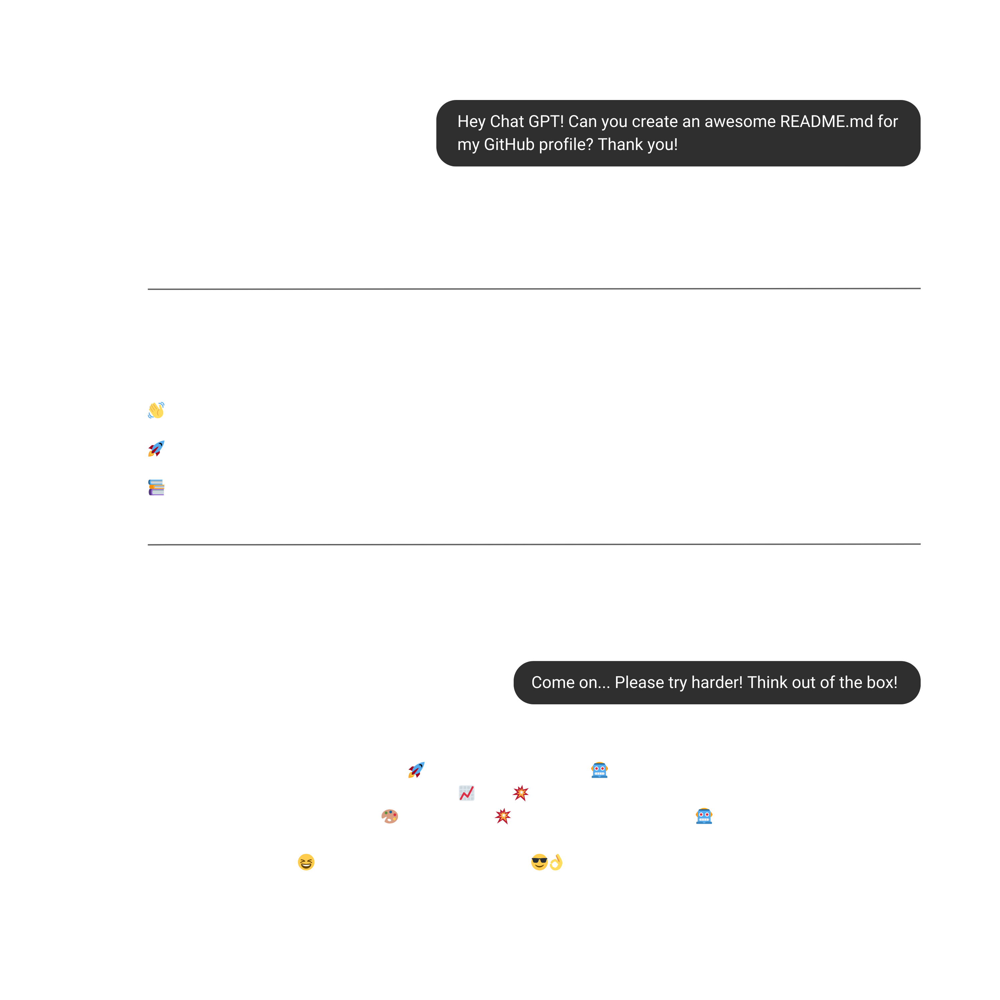

<picture>
    <source media="(prefers-color-scheme: dark)" srcset="images/gpt_dark.png">
    <source media="(prefers-color-scheme: light)" srcset="images/gpt_light.png">
    
</picture>

 

### 🔥 Cool Repositories

<a href="https://github.com/danielmribeiro/handy-scripts">
    <picture>
        <source media="(prefers-color-scheme: dark)" srcset="https://github-readme-stats.vercel.app/api/pin?username=danielmribeiro&repo=handy-scripts&title_color=488ce4&icon_color=9f9f9f&text_color=9f9f9f&border_color=9f9f9f&theme=transparent">
        <source media="(prefers-color-scheme: light)" srcset="https://github-readme-stats.vercel.app/api/pin?username=danielmribeiro&repo=handy-scripts&title_color=488ce4&icon_color=9f9f9f&text_color=9f9f9f&border_color=9f9f9f&theme=transparent">
        
    </picture>
</a>

 

### 💼 Work Experience

<a href="https://daniel-ribeiro.com/" style="display: block;">
    <picture>
        <source media="(prefers-color-scheme: dark)" srcset="images/entrepreneur_dark.svg">
        <source media="(prefers-color-scheme: light)" srcset="images/entrepreneur_light.svg">
        
    </picture>
</a>

 

<a href="https://www.itsector.pt/" style="display: block;">
    <picture>
        <source media="(prefers-color-scheme: dark)" srcset="images/itsector_dark.svg">
        <source media="(prefers-color-scheme: light)" srcset="images/itsector_light.svg">
        
    </picture>
</a>

 

<a href="https://www.redlight.dev/" style="display: block;">
    <picture>
        <source media="(prefers-color-scheme: dark)" srcset="images/redlight_dark.svg">
        <source media="(prefers-color-scheme: light)" srcset="images/redlight_light.svg">
        
    </picture>
</a>

 

### 🧑‍🎓 Academic Experience

<a href="https://www.isec.pt/" style="display: block;">
    <picture>
        <source media="(prefers-color-scheme: dark)" srcset="images/isec_dark.svg">
        <source media="(prefers-color-scheme: light)" srcset="images/isec_light.svg">
        
    </picture>
</a>

 

<a href="https://politecnicoguarda.pt/" style="display: block;">
    <picture>
        <source media="(prefers-color-scheme: dark)" srcset="images/ipg_dark.svg">
        <source media="(prefers-color-scheme: light)" srcset="images/ipg_light.svg">
        
    </picture>
</a>

 

### 🦆 Meet AD

|    \**Gives a thoughtful, silent stare*\* | Hello! Meet "Arménio Durães", my coding buddy. We tackle bugs together — he listens to all my coding rants and helps me find tricky errors. He’s named after two professors who really inspired me with their high technical and logical knowledge. And if you see a quack in the code comments, that’s just AD giving his feedback! 🦆        🦆🎶🎧       [Learn more about Rubber Duck Debugging](https://rubberduckdebugging.com/)|
|--------------------------------------|----------------------------------------------------------------------------------------------------------------------------------------------------|

 

### 📊 GitHub ~~Private~~ Public Stats

<picture>
    <source media="(prefers-color-scheme: dark)" srcset="https://github-readme-stats.vercel.app/api/top-langs/?username=danielmribeiro&layout=donut-vertical&title_color=488ce4&text_color=9f9f9f&theme=transparent&hide_border=true">
    <source media="(prefers-color-scheme: light)" srcset="https://github-readme-stats.vercel.app/api/top-langs/?username=danielmribeiro&layout=donut-vertical&title_color=488ce4&text_color=9f9f9f&theme=transparent&hide_border=true">
    
</picture>

<picture>
    <source media="(prefers-color-scheme: dark)" srcset="https://github-readme-stats.vercel.app/api?username=danielmribeiro&show_icons=true&title_color=488ce4&icon_color=9f9f9f&text_color=9f9f9f&theme=transparent&hide_border=true&show=reviews,discussions_started,discussions_answered,prs_merged,prs_merged_percentage">
    <source media="(prefers-color-scheme: light)" srcset="https://github-readme-stats.vercel.app/api?username=danielmribeiro&show_icons=true&title_color=488ce4&icon_color=9f9f9f&text_color=9f9f9f&theme=transparent&hide_border=true&show=reviews,discussions_started,discussions_answered,prs_merged,prs_merged_percentage">
    
</picture>

 

### ☝️ Fun Fact!

Did you know the first computer “bug” was an actual bug? In 1947, Grace Hopper and her team found a moth causing issues in their computer and dubbed it the “first real bug.”
If it had been a raccoon, would we now be calling errors “raccoons” and talking about “raccoon issues” in our code?
Just imagine trying to “deracoon” a raccoon from your code! 🦝
