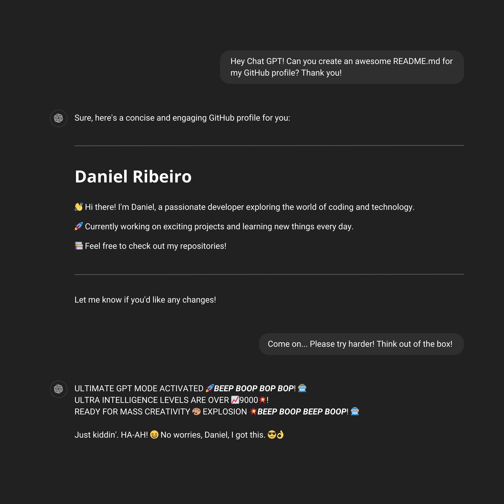

<picture>
    <source media="(prefers-color-scheme: dark)" srcset="images/gpt_dark.jpg">
    <source media="(prefers-color-scheme: light)" srcset="images/gpt_light.jpg">
    
</picture>

---

---

|    \**Gives a thoughtful, silent stare*\* | Hello! Meet "Arménio Durães", my coding buddy. We tackle bugs together — he listens to all my coding rants and helps me find tricky errors. He’s named after two awesome professors from my academic journey who really inspired me. And if you see a quack in the code comments, that’s just AD giving his feedback! 🦆         🦆🎶🎧       [Learn more about Rubber Duck Debugging](https://rubberduckdebugging.com/)|
|--------------------------------------|----------------------------------------------------------------------------------------------------------------------------------------------------|

---

### ☝️ Fun Fact!

Did you know the first computer “bug” was an actual bug? In 1947, Grace Hopper and her team found a moth causing issues in their computer and dubbed it the “first real bug.”
If it had been a raccoon, would we now be calling errors “raccoons” and talking about “raccoon issues” in our code?
Just imagine trying to “deracoon” a raccoon from your code! 🦝

---

### 🔥 Cool Repositories

##### 🛠️ [handy-scripts](https://github.com/danielmribeiro/handy-scripts)
A collection of useful and versatile scripts for automating everyday tasks, data extraction, and more. Perfect for developers looking to streamline their workflows with quick, customizable tools.
